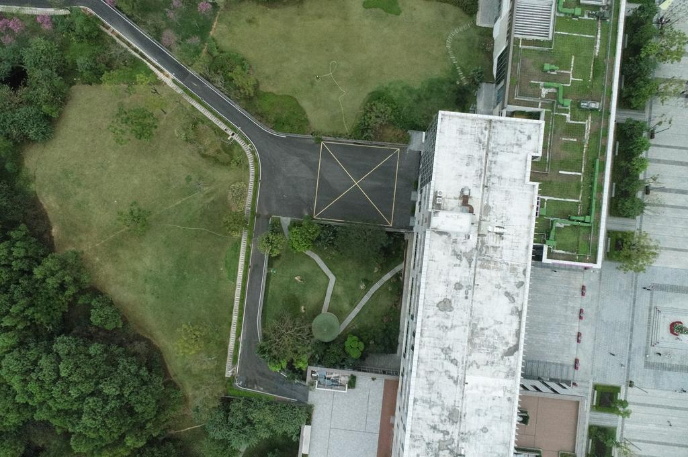
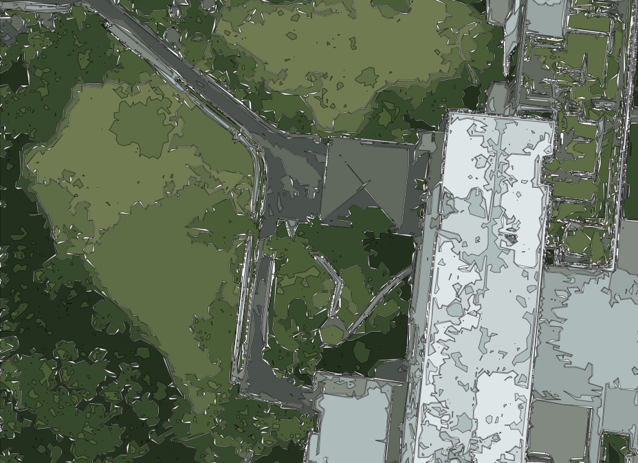
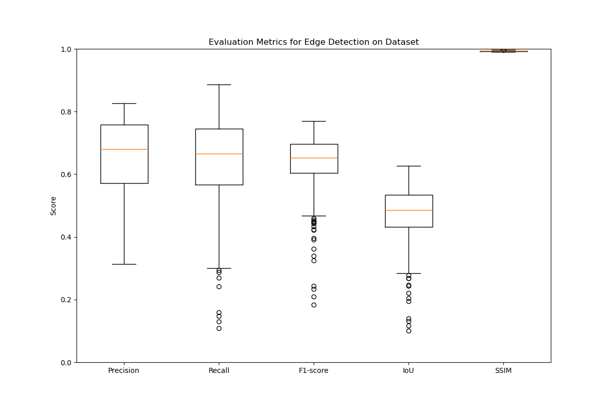
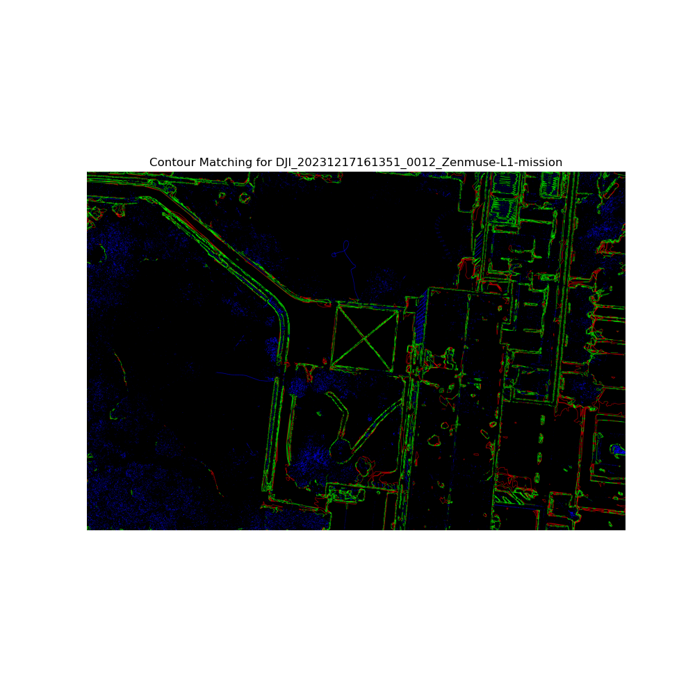

# PictureVectorization
This repository provides a toolset for converting colored JPG or PNG images into SVG files using vectorization techniques. It also includes a method to evaluate the results using various metrics and visualize the matching between the original image edges and the generated SVG contours.

## Features

- **Vectorization of Images**: Convert raster images (JPG, PNG) into scalable vector graphics (SVG) using clustering and hierarchical techniques.
- **Downsampling for Similar Edge Detection**: The code downsamples the images before vectorizing them, allowing similar edge detection performance on lower-resolution images compared to high-resolution images.
- **Edge Detection**: Perform edge detection on the original image for evaluation purposes.
- **Evaluation and Visualization**: Evaluate the SVG output against the original image edges using metrics such as precision, recall, F1-score, IoU, and SSIM. Results are visualized for easy interpretation.

## Example Workflow

Below are some example images showing the workflow:

### Original Image
Here is an example of an original image before processing:



### Vectorized SVG
The following image shows the result after vectorizing the original image:



_Note: Since SVG files cannot be directly previewed on GitHub, we are showing a rasterized preview of the SVG file._

### Evaluation Result
This image shows the evaluation result, including edge matching visualization:




## Requirements

- Python 3.x
- Required Python packages (install using `requirements.txt`):
  
```bash
pip install -r requirements.txt
```
## The key dependencies include:

- OpenCV (cv2)
- Numpy (numpy)
- Scikit-learn (sklearn)
- Matplotlib (matplotlib)
- TQDM (tqdm)
- Scikit-image (skimage)
- Svgpathtools (svgpathtools)
# How to Use
## 1. Vectorize Images
To convert your colored images (JPG/PNG) into SVG files, run the Vectorization.sh script.


```bash
bash Vectorization.sh
```
This script will:

- Process all images in the specified input directory.
- Generate vectorized SVG files and save them in the output directory.
## 2. Evaluate and Visualize Results
To evaluate the generated SVG files and compare them with the original image edges, run the evaluation.sh script.

```bash
bash evaluation.sh
```
This script will:

- Perform edge detection on the original images.
- Compare the SVG vectorized contours with the ground truth edges using several metrics: precision, recall, F1-score, IoU, and SSIM.
- Save the evaluation results as visualizations in the specified output directory.
# Directory Structure
```bash
.
├── dataset/                     # Directory for input images (JPG/PNG)
├── output/
│   ├── output_svgs/             # Directory for generated SVG files
│   ├── output_visualizations/   # Directory for visualized evaluation results
│   ├── edges/
│       ├── original_edges/      # Directory for edge detection results on the original images
│       └── svg_edges/           # Directory for vectorized SVG edge images
├── Vectorization.sh             # Bash script to run the image vectorization process
├── evaluation.sh                # Bash script to run the evaluation and visualization
├── Evaluation.py                # Python script to evaluate and visualize results
├── Preprocess.py                # Preprocessing script for image resizing
├── Vectorize.py                 # Python script to vectorize images
├── README.md                    # This README file
└── requirements.txt             # Python dependencies
```

# Results
- The vectorized SVG files will be saved in the output/output_svgs/ directory.
- Evaluation visualizations will be saved in the output/output_visualizations/ directory.
